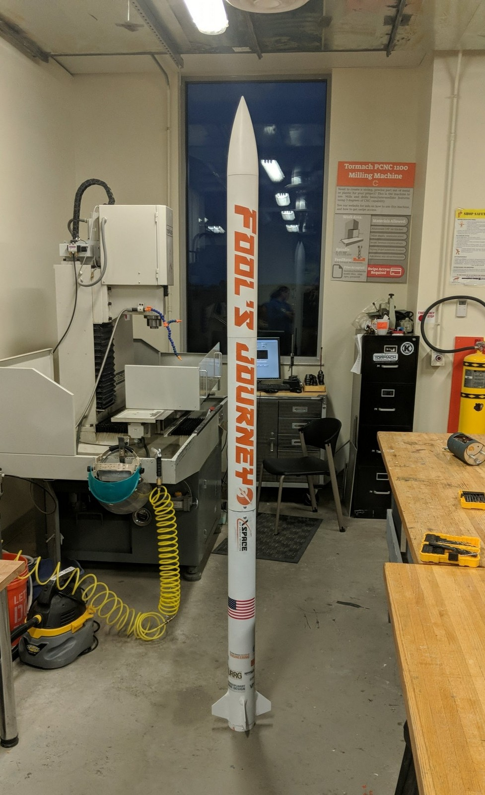
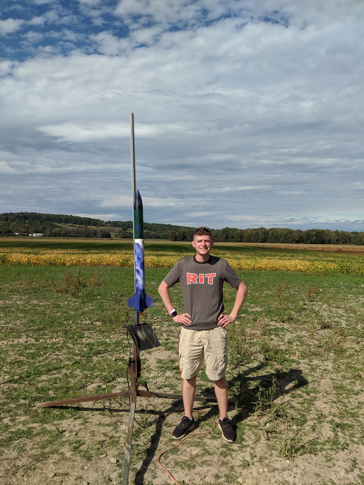
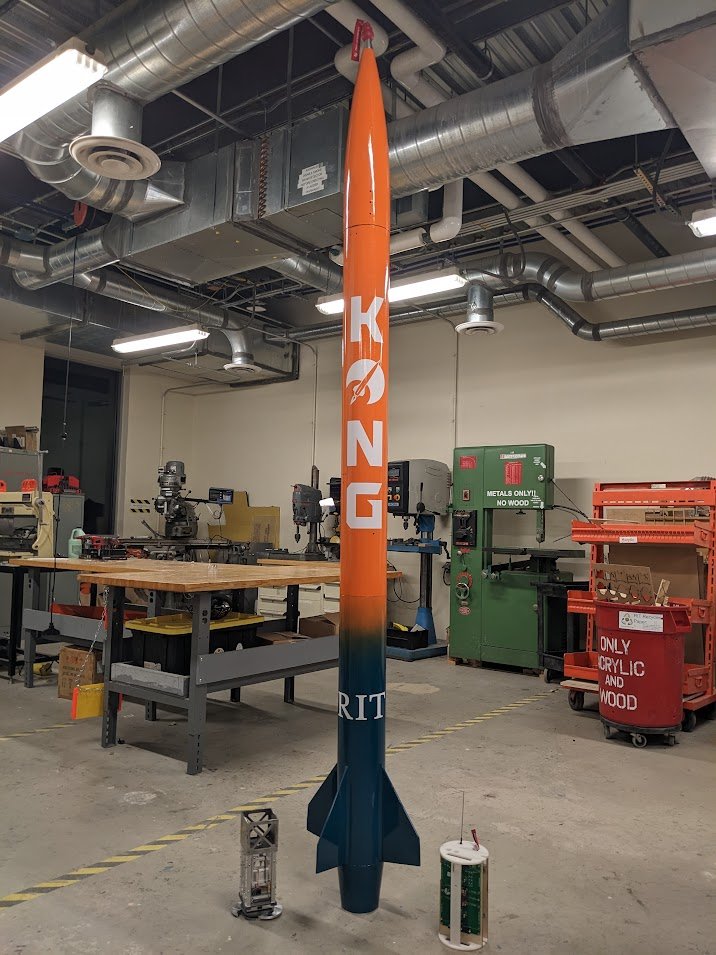

# [James May's Engineering Portfolio](http://vlarko.com)
# Projects
## Rockets
| [Fool's Journey](http://vlarko.com/Rockets/Fool's%20Journey) | [Mayfly](http://vlarko.com/Rockets/Mayfly) | [Mayflower](http://vlarko.com/Rockets/Mayflower) |
| - | - | - |
|  |  |  | 

| [KONG](http://vlarko.com/Rockets/KONG) | [VOID](http://vlarko.com/Rockets/VOID) |
| - | - |
|  |  |

## Electronics
| [Backplane Power Module](http://vlarko.com/Electronics/Backplane%20Power%20Module) | [Construct Badge](http://vlarko.com/Electronics/Construct%20Badge) | [Modular Light Cell](http://vlarko.com/Electronics/Modular%20Light%20Cell) |
| - | - | - |
|  |  |  |

## Robotics
[Autonomous Space Junk Collection](http://vlarko.com/Robotics/Autonomous%20Space%20Junk%20Collection)

[Payload Lander](http://vlarko.com/Robotics/Payload%20Lander)

## Other
[HPR Calculations Spreadsheet](http://vlarko.com/Other/HPR%20Calculations%20Spreadsheet)

[HPR Safety Checker](http://vlarko.com/Other/HPR%20Safety%20Checker)
